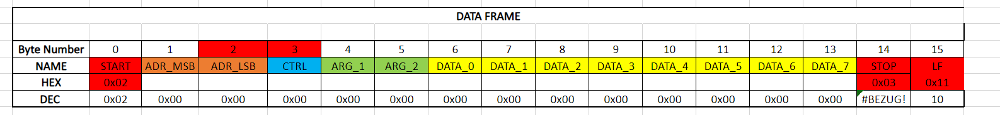
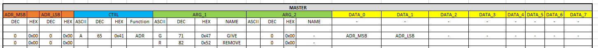
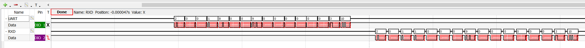

# WDIC_Raspberry_RS485

# Aufbau des Frames
## Master Request

|ADR_MSB| |ADR_LSB| |CTRL| | | |ARG_1| | | |ARG_2| | | |DATA_0|DATA_1|DATA_2|DATA_3|DATA_4|DATA_5|DATA_6|DATA_7|
|:---:|:---:|:---:|:---:|:---:|:---:|:---:|:---:|:---:|:---:|:---:|:---:|:---:|:---:|:---:|:---:|:---:|:---:|:---:|:---:|:---:|:---:|:---:|:---:|
|DEC|HEX|DEC|HEX|ASCII|DEC|HEX|Function|ASCII|DEC|HEX|NAME|ASCII|DEC|HEX|NAME|-|-|-|-|-|-|-|-|
| | | | | | | | | | | | | | | | | | | | | | | | |
|0|0x00|0|0x00|A|65|0x41|ADR|G|71|0x47|GIVE| |0|0x00|-|ADR_MSB|ADR_LSB|-|-|-|-|-|-|
|0|0x00|0|0x00| | | | |R|82|0x52|REMOVE| |0|0x00|-| | | | | | | | |
|var| |var| |S|83|0x53|GET_STATE| |0|0x00|-| |0|0x00|-|-|-|-|-|-|-|-|-|
|var| |var| |F|70|0x46|GET_FRQ| |0|0x00|-| |0|0x00|-|MEASURE_TIME_MSB|MEASURE_TIME_LSB|-|-|-|-|-|-|
|var| |var| |L|76|0x4C|GET_L| |0|0x00|-| |0|0x00|-|-|-|-|-|-|-|-|-|
|var| |var| |0|48|0x30|IO0|D|68|0x44|SET_IN_OUT| |var|var|IN_OUT|-|-|-|-|-|-|-|-|
|var| |var| | | | | |B|66|0x42|READ| |0|0x00|-|-|-|-|-|-|-|-|-|
|var| |var| | | | | |I|73|0x49|SET| |var|var|ON_OFF|-|-|-|-|-|-|-|-|
|var| |var| |1|49|0x31|IO1|D|68|0x44|SET_IN_OUT| |var|var|IN_OUT|-|-|-|-|-|-|-|-|
|var| |var| | | | | |B|66|0x42|READ| |0|0x00|-|-|-|-|-|-|-|-|-|
|var| |var| | | | | |I|73|0x49|SET| |0|0x00|ON_OFF|-|-|-|-|-|-|-|-|
|var| |var| |C|67|0x43|CALIBRATE| |-|-|-| |0|0x00|-|FRQ_MSB|FRQ_LSB|-|-|-|-|-|-|
|var| |var| | | |0x00| | |-|-|-| |0|0x00|-|-|-|-|-|-|-|-|-|
|var| |var| | | |0x00| | |-|-|-| |0|0x00|-|-|-|-|-|-|-|-|-|
|var| |var| |P|80|0x50|PING| |-|-|-| |0|0x00|-|-|-|-|-|-|-|-|-|

## Slave Response

|DEC|HEX|DEC|HEX|ASCII|DEC|HEX|Function| |DEC|HEX|NAME| |DEC|HEX|NAME|-|-|-|-|-|-|-|-|
|:---:|:---:|:---:|:---:|:---:|:---:|:---:|:---:|:---:|:---:|:---:|:---:|:---:|:---:|:---:|:---:|:---:|:---:|:---:|:---:|:---:|:---:|:---:|:---:|
| | | | | | | | | | | | | | | | | | | | | | | | |
|0|0x00|1|0x01|A|65|0x41|ADR| |71|0x47|GIVE| |1|0x01|-|-|-|-|-|-|-|-|-|
|0|0x00|1|0x01|S|83|0x53|GET_STATE| |0|0x00|-| |0|0x00|-|IO0_IN_OUT|IO0_STATE|IO1_IN_OUT|IO1_STATE|-|-|-|-|
|0|0x00|1|0x01|F|70|0x46|GET_FRQ| |0|0x00|-| |0|0x00|-|FRQ_MSB|FRQ|FRG|FRQ_LSB| | | | |
|0|0x00|1|0x01|L|76|0x4C|GET_L| |0|0x00|-| |0|0x00|-|L| | | | | | | |
|0|0x00|1|0x01|0|48|0x30|IO0| |68|0x44|SET_IN_OUT| |var|var|IN_OUT|IN_OUT|-|-|-|-|-|-|-|
|0|0x00|1|0x01| | | |0| |66|0x42|READ| |0|0x00|-|READ_IO0|-|-|-|-|-|-|-|
|0|0x00|1|0x01| | | |0| |73|0x49|SET| |var|var|ON_OFF|READ_IO0|-|-|-|-|-|-|-|
|0|0x00|1|0x01|1|49|0x31|IO1| |68|0x44|SET_IN_OUT| |var|var|IN_OUT|IN_OUT|-|-|-|-|-|-|-|
|0|0x00|1|0x01| | | |0| |66|0x42|READ| |0|0x00|-|READ_IO1|-|-|-|-|-|-|-|
|0|0x00|1|0x01| | | |0| |73|0x49|SET| |0|0x00|ON_OFF|READ_IO1|-|-|-|-|-|-|-|
|0|0x00|1|0x01|C|67|0x43|CALIBRATE| |-|-|-| |0|0x00|-|F0_MSB|F0_LSB|-|-|-|-|-|-|
|0|0x00|1|0x01| | |0x00|0| |-|-|-| |0|0x00|-|-|-|-|-|-|-|-|-|
|0|0x00|1|0x01| | |0x00|0| |-|-|-| |0|0x00|-|-|-|-|-|-|-|-|-|
|0|0x00|1|0x01|P|80|0x50|PING| |-|-|-| |0|0x00|-|ADR_MSB|ADR_LSB|LOCAL_ADR_MSB|LOCAL_ADR_LSB|CTRL|ARG_1|ARG_2|CROSSOVER|

# Zuweisung der Befehlswerte beispielhaft

CTRL: Befehl
ARG1 / ARG2: Zusatzoptionen
DATA[0:8] Datenbytes

# Ping am Oszilloskop
Oben des Gesendete Packet des Raspberry
Unten die Antwort des Slaves

